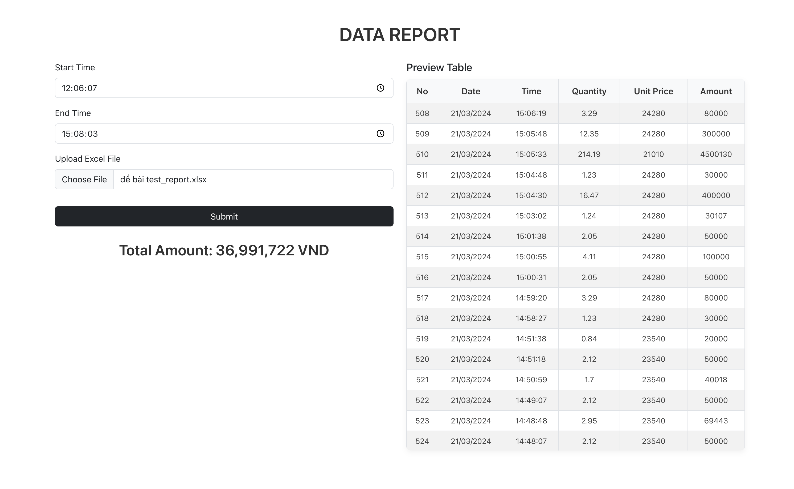

# Task 1 – Data Report
Task 1 là một React component `DataReport` giúp người dùng:
- Upload file Excel chứa dữ liệu bán hàng.
- Chọn khoảng thời gian Start Time và End Time.
- Hiển thị preview bảng dữ liệu trong khoảng thời gian đã chọn.
- Tính tổng Amount của các giao dịch được lọc.

Tính năng chính:
- Upload file Excel và đọc dữ liệu bằng xlsx.
- Nhập thời gian bắt đầu và kết thúc (`input type="time"`).
- Lọc dữ liệu dựa trên khoảng thời gian.
- Hiển thị preview table và tổng số tiền.
- Responsive, sử dụng `Bootstrap`.
## 1. Cấu trúc dự án

```bash
task1/
├─ public/                     
├─ src/                         # Source code chính
│  ├─ components/               # Chứa các component tái sử dụng
│  │  ├─ DataReport.js          # Component hiển thị báo cáo dữ liệu
│  │  └─ DataReport.scss        # File style SCSS cho DataReport
│  ├─ App.css                   # CSS chính cho App
│  ├─ App.js                    # File chính của ứng dụng React
│  ├─ App.test.js               
│  ├─ index.css              
│  ├─ index.js                  # Điểm khởi chạy của React app
│  ├─ logo.svg                  # Logo React mặc định
│  ├─ reportWebVitals.js      
│  └─ setupTests.js            
├─ README.md                    # Tài liệu hướng dẫn project
├─ package-lock.json            # Lock phiên bản dependencies
└─ package.json                 # Cấu hình project + dependencies
```

## 2. Cách thực hiện
### 2.1 Tạo component `DataReport` trong `src/components/`
```javascript
import React, { useState } from "react";
import * as XLSX from "xlsx";
```
### 2.2 Upload file Excel và đọc dữ liệu
```javascript
 const handleUploadFile = (e) => {
  const reader = new FileReader();
  reader.onload = (evt) => {
    const workbook = XLSX.read(new Uint8Array(evt.target.result), { type: "array" });
    const sheet = workbook.Sheets[workbook.SheetNames[0]];
    setData(XLSX.utils.sheet_to_json(sheet, { header: 1 }));
  };
  reader.readAsArrayBuffer(e.target.files[0]);
};
```
## 2.3 Chọn Start/End Time và lọc dữ liệu
```javascript
const filtered = data.slice(8).filter(row => {
  const [h, m, s] = row[2].split(":").map(Number);
  const secs = h*3600 + m*60 + s;
  return secs >= startSec && secs <= endSec;
});


```
### 2.4 Hiển thị Preview Table và tính tổng Amount

```javascript
let total = filtered.reduce((sum, row) => sum + Number(row[8] || 0), 0);
setPreviewData(filtered);
setTotal(total);

  ```
## 3. Hướng dẫn thực thi
### 3.1 Clone dự án & cài dependencies
```bash
git clone <https://github.com/nini048/fe_test.git>
cd task1
npm install
```
### 3.2 Chạy ứng dụng
```bash
npm start
```
### 3.3 Mở trình duyệt truy cập
```bash
http://localhost:3000
```
### 3.4 Sử dụng
- Upload file Excel.
- Chọn Start Time và End Time.
- Nhấn Submit để xem dữ liệu lọc và tổng Amount.
## Screenshots

