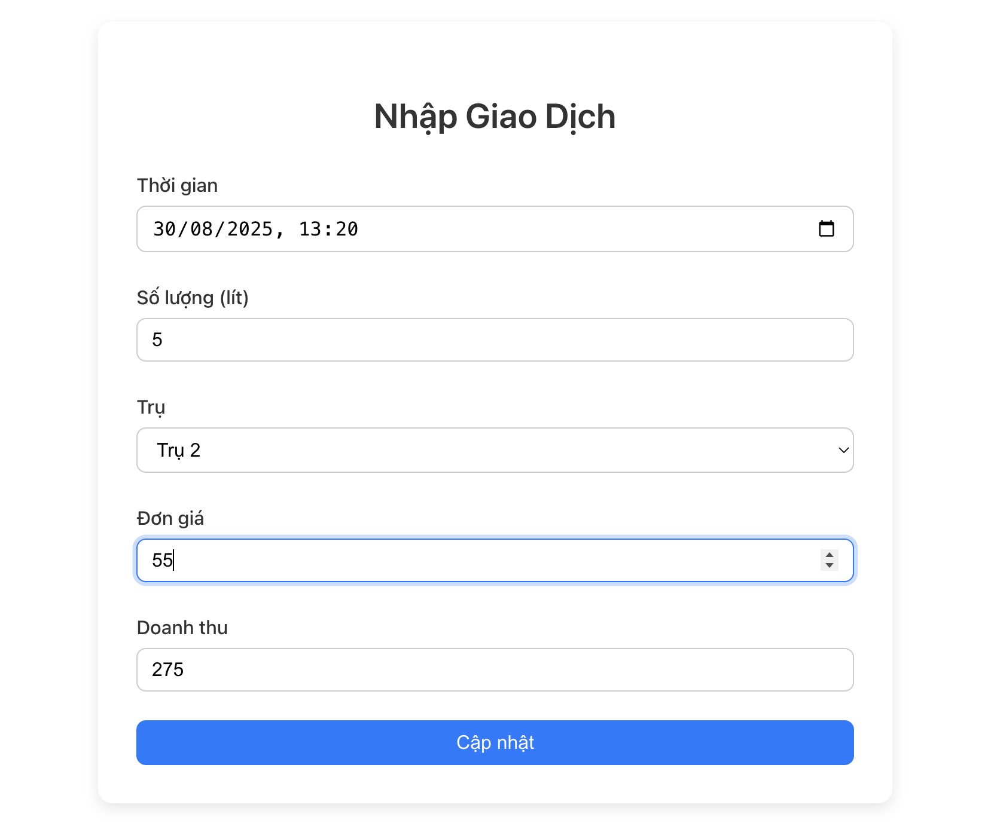

# Task 2 – Transaction Form

Task 2 là một React component `TransactionForm`giúp người dùng nhập thông tin giao dịch bán hàng:
- Nhập thời gian (datetime-local).
- Nhập số lượng (lít).
- Chọn trụ bơm.
- Nhập đơn giá.
- Tự động tính doanh thu (số lượng × đơn giá).
- Validate dữ liệu bằng `Yup` + `react-hook-form`.
- Hiển thị thông báo thành công bằng `notistack`.
## 1. Cấu trúc dự án

```bash
task2/
├─ public/            
├─ src/                         
│  ├─ components/               # Component tái sử dụng
│  │  ├─ TransactionForm.js     # Form nhập giao dịch (React + Yup + React Hook Form)
│  │  └─ Transaction.scss       # Style SCSS cho TransactionForm
│  ├─ App.css                  
│  ├─ App.js                    # File App chính (render TransactionForm)
│  ├─ App.test.js              
│  ├─ index.css                 # CSS toàn cục
│  ├─ index.js                  # Điểm khởi chạy của ứng dụng React
│  ├─ logo.svg                  
│  ├─ reportWebVitals.js      
│  └─ setupTests.js             
├─ README.md                    # Tài liệu mô tả Task 2
├─ package-lock.json            # Lock dependencies
└─ package.json                 # Khai báo dependencies và scripts
```

## 2. Cách thực hiện
- Tạo component `TransactionForm` trong `src/components/` để nhập giao dịch.
```javascript
import React from "react";
import { useForm } from "react-hook-form";
import { yupResolver } from "@hookform/resolvers/yup";
import * as Yup from "yup";
import { useSnackbar } from 'notistack';
```
- Định nghĩa schema validation với `Yup` để kiểm tra thời gian, số lượng, trụ bơm, và đơn giá.
```javascript
 cconst schema = Yup.object().shape({
  time: Yup.string().required("Vui lòng chọn thời gian"),
  amount: Yup.number().positive().required(),
  pump: Yup.string().required(),
  price: Yup.number().positive().required(),
});

```
- Sử dụng React Hook Form kết hợp schema validation và notistack để quản lý form, hiển thị lỗi và thông báo
```javascript
const { register, handleSubmit, formState: { errors }, reset, watch } = useForm({
  resolver: yupResolver(schema)
});

```
- Tính doanh thu tự động dựa trên `amount * price` và hiển thị read-only

```javascript
<input
  type="number"
  value={watch("amount") * watch("price") || ""}
  readOnly
/>
  ```
  - Submit form hiển thị thông báo thành công và reset form
  ```javascript
const onSubmit = (data) => {
  enqueueSnackbar('Cập nhật thành công!', { variant: 'success' });
  reset();
};

  ```
## 3. Hướng dẫn thực thi
### 3.1 Clone dự án & cài dependencies
```bash
git clone https://github.com/nini048/fe_test.git
cd task2
npm install
```
### 3.2 Chạy ứng dụng
```bash
npm start
```
### 3.3 Mở trình duyệt truy cập
```bash
http://localhost:3000
```
### 3.4 Sử dụng
- Nhập thông tin giao dịch: Thời gian, Số lượng, Trụ bơm, Đơn giá.
- Xem Doanh thu tự động tính bằng Số lượng * Đơn giá.
- Nhấn Cập nhật để lưu giao dịch và hiển thị thông báo thành công.
## Screenshots

